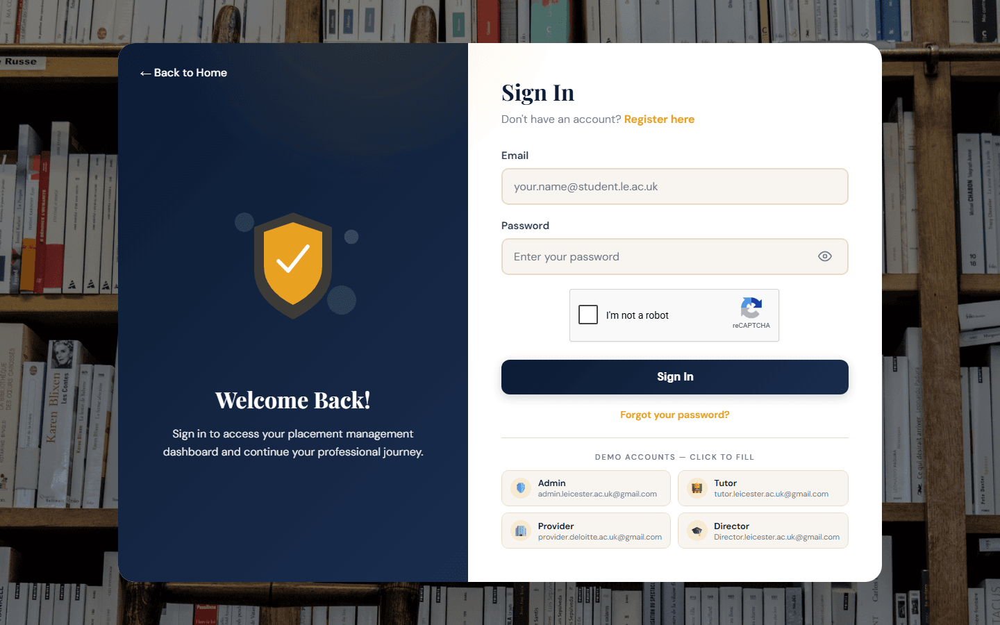

# InPlace — Placement Management System

InPlace is a web-based placement management system for university placement
teams, built for the University of Leicester. It connects **students**,
**tutors**, **employers (providers)**, **programme directors** and
**administrators** in one platform to manage placements end-to-end —
from applications and approvals, through visits and reflections, to
reporting and analytics.

🌐 **Live demo:** https://inplace-uup1.onrender.com/inplace/login.php



---

## Features

### Student
- Register and track placement application status (pending / approved / rejected)
- View current placement details and provider information
- Submit and manage tutor visit requests
- Write and submit placement reflections/reports
- Upload supporting documents (CVs, agreements, etc.)
- Receive announcements and messages
- View placement change requests

### Tutor
- Create and manage student placements
- Schedule and record tutor visits (with calendar integration)
- Map view of all student placement locations
- Review "at-risk" students (e.g. missed visits, low engagement)
- Manage provider directory and provider meetings
- Review and respond to placement change requests
- Messaging with students and providers
- Generate reports

### Provider (Employer)
- Dashboard of assigned students
- Confirm/accept placement offers
- Log and manage workplace issues
- Evaluate students at end of placement
- View and respond to tutor visit requests
- Messaging with tutors and students

### Director (Programme Director)
- Programme-wide dashboard and analytics
- Placement overview across all students
- Map view of all active placements
- At-risk student monitoring
- Employer feedback summaries
- Export reports

### Admin
- Approve/reject student & user registrations
- Manage all users (students, tutors, providers, directors)
- Manage placements (create, edit, export)
- System settings (reCAPTCHA keys, email config, etc.)
- Audit log of system activity

### Platform-wide
- Email notifications (PHPMailer) and OTP-based verification
- reCAPTCHA v2 protected login/registration
- In-app messaging and notification center
- Document & report uploads (local disk or S3-compatible storage)
- Password reset flow
- Role-based dashboards and navigation

---

## Tech Stack

- **Backend**: PHP 8.2 (vanilla PHP, no framework), PDO/MySQLi for data access
- **Database**: MySQL 8 (Aiven free tier in production, MariaDB/XAMPP locally)
- **Frontend**: HTML, CSS, vanilla JavaScript (server-rendered pages)
- **Email**: [PHPMailer](https://github.com/PHPMailer/PHPMailer)
- **File storage**: Local filesystem (dev) or Cloudflare R2 / S3-compatible
  storage (production) via `aws/aws-sdk-php`
- **Containerization**: Docker (`php:8.2-apache`)
- **Hosting**: [Render](https://render.com) (Docker web service, free tier)

---

## Project Structure

```
inplace/
├── admin/              Admin dashboards, user management, settings
├── director/           Programme director dashboards & reports
├── tutor/              Tutor dashboards, placements, visits, providers
├── provider/           Provider (employer) dashboards & evaluations
├── student/            Student dashboards, placements, reflections
├── api/                JSON endpoints (calendar, messages, notifications, OTP, etc.)
├── actions/            Shared POST-handler scripts (uploads, reflections, visits)
├── includes/           Shared layout (header/footer/sidebar), auth, helpers
├── config/             DB connection, app config, email config
├── assets/             Images, uploads, static files
├── docker/             Dockerfile entrypoint & Apache config
├── tools/              One-off maintenance/utility scripts
├── PHPMailer-master/   Vendored PHPMailer library
├── login.php           Login page (with demo account quick-fill)
├── register.php        Student registration (with admin approval workflow)
├── dashboard.php       Role-based dashboard router
└── ...
```

---

## Database

The application uses a single MySQL database with the following tables:

`users`, `companies`, `placements`, `placement_opportunities`,
`placement_change_requests`, `placement_notifications`, `documents`,
`reflections`, `reports`, `visits`, `provider_meetings`, `provider_evaluations`,
`provider_issues`, `provider_tokens`, `announcements`, `announcement_reads`,
`messages`, `notifications`, `audit_log`, `otp_codes`, `password_resets`,
`system_settings`, `tutor_settings`.

Key `users` columns include `role` (`student`, `tutor`, `provider`, `admin`,
`director`), `approval_status` (`pending`, `approved`, `rejected`), plus
academic profile fields (`academic_year`, `programme_type`, etc.).

---

## Local Development Setup (XAMPP)

1. Clone this repo into your XAMPP `htdocs` folder (e.g. `C:\xampp\htdocs\inplace`).
2. Start Apache and MySQL via the XAMPP control panel.
3. Create a database named `inplace_db` and import the schema/data dump.
4. Install PHP dependencies:
   ```bash
   composer install
   ```
5. `config/db.php` defaults to `localhost` / `root` / no password / `inplace_db`
   — adjust if your local MySQL credentials differ (or set the `DB_HOST`,
   `DB_USER`, `DB_PASS`, `DB_NAME`, `DB_PORT` environment variables).
6. Visit `http://localhost/inplace/login.php`.

### Demo accounts (password: `password`)

| Role     | Email                              |
|----------|-------------------------------------|
| Admin    | admin.leicester.ac.uk@gmail.com     |
| Tutor    | tutor.leicester.ac.uk@gmail.com     |
| Provider | provider.deloitte.ac.uk@gmail.com   |
| Director | Director.leicester.ac.uk@gmail.com  |

These are also available as one-click "Demo Accounts" buttons on the login page.

---

## Deployment

InPlace is deployed for free using:

- **App** → [Render](https://render.com) (Docker web service)
- **Database** → [Aiven](https://aiven.io) (free MySQL)
- **File storage** → [Cloudflare R2](https://developers.cloudflare.com/r2/) (S3-compatible)

Every push to `main` automatically triggers a rebuild and redeploy on Render.

See [DEPLOYMENT.md](DEPLOYMENT.md) for full setup details, environment
variables, and how to apply schema changes.

---

## Environment Variables

| Variable | Purpose |
|---|---|
| `DB_HOST`, `DB_PORT`, `DB_NAME`, `DB_USER`, `DB_PASS` | MySQL connection |
| `DB_SSL_CA` | Optional CA cert path for DB TLS |
| `R2_ACCOUNT_ID`, `R2_ACCESS_KEY_ID`, `R2_SECRET_ACCESS_KEY`, `R2_BUCKET`, `R2_PUBLIC_URL` | Cloudflare R2 file storage |

reCAPTCHA and email settings are configured at runtime via **Admin → Settings**
(stored in the `system_settings` table), not environment variables.

---

## License

This project was built for educational purposes as part of a university
placement management coursework/project.
